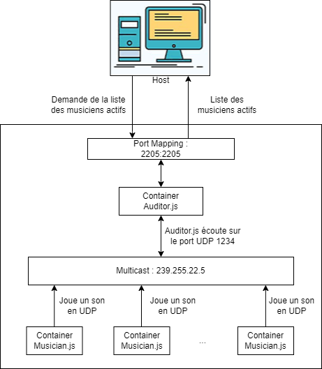

# Teaching-HEIGVD-API-2022-Labo-Orchestra

## Admin

- **You can work in groups of 2 students**.
- It is up to you if you want to fork this repo, or if you prefer to work in a private repo. However, you have to **use exactly the same directory structure for the validation procedure to work**.
- We expect that you will have more issues and questions than with other labs (because we have a left some questions open on purpose). Please ask your questions on Teams, so that everyone in the class can benefit from the discussion.
- ⚠️ You will have to send your GitHub URL, answer the questions and send the output log of the `validate.sh` script, which prove that your project is working [in this Google Form](https://forms.gle/6SM7cu4cYhNsRvqX8).

## Objectives

This lab has 4 objectives:

- The first objective is to **design and implement a simple application protocol on top of UDP**. It will be very similar to the protocol presented during the lecture (where thermometers were publishing temperature events in a multicast group and where a station was listening for these events).

- The second objective is to get familiar with several tools from **the JavaScript ecosystem**. You will implement two simple **Node.js** applications. You will also have to search for and use a couple of **npm modules** (i.e. third-party libraries).

- The third objective is to continue practicing with **Docker**. You will have to create 2 Docker images (they will be very similar to the images presented in class). You will then have to run multiple containers based on these images.

- Last but not least, the fourth objective is to **work with a bit less upfront guidance**, as compared with previous labs. This time, we do not provide a complete webcast to get you started, because we want you to search for information (this is a very important skill that we will increasingly train). Don't worry, we have prepared a fairly detailed list of tasks that will put you on the right track. If you feel a bit overwhelmed at the beginning, make sure to read this document carefully and to find answers to the questions asked in the tables. You will see that the whole thing will become more and more approachable.

## Requirements

In this lab, you will **write 2 small NodeJS applications** and **package them in Docker images**:

- the first app, **Musician**, simulates someone who plays an instrument in an orchestra. When the app is started, it is assigned an instrument (piano, flute, etc.). As long as it is running, every second it will emit a sound (well... simulate the emission of a sound: we are talking about a communication protocol). Of course, the sound depends on the instrument.

- the second app, **Auditor**, simulates someone who listens to the orchestra. This application has two responsibilities. Firstly, it must listen to Musicians and keep track of **active** musicians. A musician is active if it has played a sound during the last 5 seconds. Secondly, it must make this information available to you. Concretely, this means that it should implement a very simple TCP-based protocol.


### Instruments and sounds

The following table gives you the mapping between instruments and sounds. Please **use exactly the same string values** in your code, so that validation procedures can work.

| Instrument | Sound       |
| ---------- | ----------- |
| `piano`    | `ti-ta-ti`  |
| `trumpet`  | `pouet`     |
| `flute`    | `trulu`     |
| `violin`   | `gzi-gzi`   |
| `drum`     | `boum-boum` |

### TCP-based protocol to be implemented by the Auditor application

- The auditor should include a TCP server and accept connection requests on port 2205.
- After accepting a connection request, the auditor must send a JSON payload containing the list of <u>active</u> musicians, with the following format (it can be a single line, without indentation):

```
[
  {
  	"uuid" : "aa7d8cb3-a15f-4f06-a0eb-b8feb6244a60",
  	"instrument" : "piano",
  	"activeSince" : "2016-04-27T05:20:50.731Z"
  },
  {
  	"uuid" : "06dbcbeb-c4c8-49ed-ac2a-cd8716cbf2d3",
  	"instrument" : "flute",
  	"activeSince" : "2016-04-27T05:39:03.211Z"
  }
]
```

### What you should be able to do at the end of the lab

You should be able to start an **Auditor** container with the following command:

```
$ docker run -d -p 2205:2205 res/auditor
```

You should be able to connect to your **Auditor** container over TCP and see that there is no active musician.

```
$ telnet IP_ADDRESS_THAT_DEPENDS_ON_YOUR_SETUP 2205
[]
```

You should then be able to start a first **Musician** container with the following command:

```
$ docker run -d res/musician piano
```

After this, you should be able to verify two points. Firstly, if you connect to the TCP interface of your **Auditor** container, you should see that there is now one active musician (you should receive a JSON array with a single element). Secondly, you should be able to use `tcpdump` to monitor the UDP datagrams generated by the **Musician** container.

You should then be able to kill the **Musician** container, wait 5 seconds and connect to the TCP interface of the **Auditor** container. You should see that there is now no active musician (empty array).

You should then be able to start several **Musician** containers with the following commands:

```
$ docker run -d res/musician piano
$ docker run -d res/musician flute
$ docker run -d res/musician flute
$ docker run -d res/musician drum
```

When you connect to the TCP interface of the **Auditor**, you should receive an array of musicians that corresponds to your commands. You should also use `tcpdump` to monitor the UDP trafic in your system.

# Tasks and questions

Reminder: answer the following questions [here](https://forms.gle/6SM7cu4cYhNsRvqX8).

## Task 1: design the application architecture and protocols

| #        | Topic                                                        |
| -------- | ------------------------------------------------------------ |
| Question | How can we represent the system in an **architecture diagram**, which gives information both about the Docker containers, the communication protocols and the commands? |
|          | _._                              |
| Question | Who is going to **send UDP datagrams** and **when**?         |
|          | _Les musiciens (les containers faisant tourner musician.js) vont envoyer un message toute les secondes._ |
| Question | Who is going to **listen for UDP datagrams** and what should happen when a datagram is received? |
|          | _Les auditeurs (les containers faisant tourner auditor.js) vont écouter et réceptionner les datagrammes UDP. Lors de la réception d'un datagrams, on sauvegarde le musicien qui vien de jouer dans un tableau avec son id et son instrument. On sauvegarde aussi le moment ou on l'a entendu. Si le musicien existe déjà, on update seulement le moment où on l'a entendu._ |
| Question | What **payload** should we put in the UDP datagrams?         |
|          | _Le son de l'instrument du musicien, ainsi que l'id du musicien ayant joué cet instrument._ |
| Question | What **data structures** do we need in the UDP sender and receiver? When will we update these data structures? When will we query these data structures? |
|          | _Pour le sender (AKA le musicien), nous avons un objet JSON qui est envoyé au receiver (AKA l'auditeur) toute les secondes. Cet objet JSON n'aura jamais besoin d'être modifié une fois créé, puisqu'il contient des informations propre à chaque sender.<br />Pour ce qui est du receiver, nous avons ici un tableau d'objet JSON représentant les sender actif. Ce tableau est mis à jour quand un nouveau musicien commence à jouer, ou quand un musicien est silencieux depuis trop longtemps, auquel cas nous supprimons l'entrée correspondant à ce musicien dans le tableau. Le tableau nous est transmis lorsqu'on se connecte au receiver sur le port 1234 en tcp._ |

## Task 2: implement a "musician" Node.js application

| #        | Topic                                                        |
| -------- | ------------------------------------------------------------ |
| Question | In a JavaScript program, if we have an object, how can we **serialize it in JSON**? |
|          | _A l'aide de la méthode JSON.stringify()._                   |
| Question | What is **npm**?                                             |
|          | _npm est le gestionnaire de paquets par défaut pour l'environnement d'exécution JavaScript Node.js. Cela permet d'installer des modules de telle sorte que node.js puisse les trouver, et gère aussi les conflit de dépendance proprement._ |
| Question | What is the `npm install` command and what is the purpose of the `--save` flag? |
|          | _npm install est la commande permettant d'installer un package et ses dépendance dans le répertoire ou la commande est effectuée. Depuis npm5, --save n'a plus d'utilité, avant npm5, --save permettait de sauvegarder les package dans le fichier package.json (ce qui est fait automatiquement pas npm install depuis npm5)._ |
| Question | How can we use the `https://www.npmjs.com/` web site?        |
|          | _Ce site fonctionne un peu comme docker-hub, dans le sens où il sert de stockage de projet pouvant être utilisé par d'autre développeur. En effet, la commande npm va chercher les package sur ce site afin de les installer._ |
| Question | In JavaScript, how can we **generate a UUID** compliant with RFC4122? |
|          | _Il existe un package, nommé uuid, permettant de générer des uuid et pouvant être installé grâce à la commande npm. Nous avons utilisé la version 1 dans notre projet, la version 4 est également souvent proposée lorsqu'on cherche comment utiliser ce package. De plus, il existe un autre package permettant de générer des uuidv4, le package crypto avec la méthode crypto.randomUUID()._ |
| Question | In Node.js, how can we execute a function on a **periodic** basis? |
|          | _Grâce à la fonction setInterval(callback, delay). Le paramètre callback attend une fonction, qui sera appelée tous les "delay" time, delay étant un paramètre numérique correspondant au temps en milliseconde entre deux appels de la fonction callback._ |
| Question | In Node.js, how can we **emit UDP datagrams**?               |
|          | _Grâce à un module nommé dgram qui permet d'ouvrir des socket udp4 ou udp6. Une fois ce socket affecté à une constante, nous pouvons appeler la méthode <br />`socket.send(msg[, offset, length][, port][, address][, callback])`<br /> msg : Message à envoyer<br /> offset : Offset ou le message commence dans le buffer.<br /> length : nombre de byte dans le message <br /> port : Port de destination<br /> address : Adresse IP de destination<br /> callback : Fonction appelée après l'envoi de données_ |
| Question | In Node.js, how can we **access the command line arguments**? |
|          | _En affectant le résultat de la méthode process.argv[x] (où x correspond au numéro de l'argument que l'on souhaite récupérer) à une variable._ |

## Task 3: package the "musician" app in a Docker image

| #        | Topic                                                        |
| -------- | ------------------------------------------------------------ |
| Question | How do we **define and build our own Docker image**?         |
|          | _Pour construire une image Docker, il faut d'abord posséder un dockerfile possédant des configurations correctes. Puis, une fois ce dockerfile créé et remplis, il faut ouvrir un terminal au même niveau que le dockerfile et entrer la commande `docker build -t nomImage .`. L'espace suivit d'un point est important car il permet d'indiquer que le dockerfile à utiliser se trouve dans le répertoire actuel._ |
| Question | How can we use the `ENTRYPOINT` statement in our Dockerfile? |
|          | _`ENTRYPOINT` s'utilise de la même manière que `CMD`, les deux permettent d'exécuter une ligne de commande au lancement du containers. Exemple : ENTRYPOINT ["node", "/opt/app/musician.js"]_ |
| Question | After building our Docker image, how do we use it to **run containers**? |
|          | _Pour run un container, il faut utiliser la commande `docker run nomImage`. Il est possible de rajouter de nombreux paramètre entre le run et le nomImage lors de l'exécution de cette commande. Les deux paramètre ayant le plus été utilisé durant le cours d'API sont le `-d` qui permet de lancer le container en arrière plan, et -p qui permet de faire du port mapping afin de pouvoir communiquer avec le container depuis la machine hôte (si on ne travaille pas avec linux)._ |
| Question | How do we get the list of all **running containers**?        |
|          | _avec la commande `docker ps`._                              |
| Question | How do we **stop/kill** one running container?               |
|          | _Il y a deux manière de stopper un container en train de fonctionner. La première permet de demander au processus principal du container de s'arrêter avec la commande `docker stop containerName`. La deuxième arrête le container sans vérifier quoi que ce soit, un peu comme si on débranchait la prise, avec la commande `docker kill containerName`_ |
| Question | How can we check that our running containers are effectively sending UDP datagrams? |
|          | _Grâce à wireshark où tcpdump._                              |

## Task 4: implement an "auditor" Node.js application

| #        | Topic                                                        |
| -------- | ------------------------------------------------------------ |
| Question | With Node.js, how can we listen for UDP datagrams in a multicast group? |
|          | _Grâce au même package que celui utilisé dans les musiciens, à savoir dgram. Cependant, ici, on va se bind à un port et "s'abboner" à un adresse IP grâce à la méthode addMembership d'un socket et l'écouter en permanence._ |
| Question | How can we use the `Map` built-in object introduced in ECMAScript 6 to implement a **dictionary**? |
|          | _L'objet `Map` représente déjà un dictionnaire, autrement dit une carte de clés/valeurs. N'importe quelle valeur valable en JavaScript (que ce soit les objets ou les valeurs de types primitifs) peut être utilisée comme clé ou comme valeur. Une fois les données entrées dans le dictionnaire, on peut récupérer la valeur grâce à la méthode get(id)._ |
| Question | How can we use the `Moment.js` npm module to help us with **date manipulations** and formatting? |
|          | Le module contient la fonction "moment()" qui nous retourne la date actuelle (si appelée sans paramètres). Elle contient en plus de cela une fonction "format()" qui permet le formater la date envoyée par "moment()". Elle contient plein d'options de formatages différents disponible sur la documentation officielle du module. |
| Question | When and how do we **get rid of inactive players**?          |
|          | _On supprime les musicien quand ils sont déclarés inactifs. Un musicien est déclaré inactifs quand aucun son n'a été reçu de sa part depuis plus de 5 secondes. Pour déterminer si un musicien est actif ou non, nous stockons un objet setTimeout de 5 seconde dans un tableau à chaque fois qu'on reçois un son d'un musicien. Si le musicien a déjà un objet setTimeout existant dans le tableau, on le supprime avant d'en recréer un nouveau. De cette manière, si les 5 seconde d'attente du setTimeout arrivent au bout, une méthode supprimant le musicien représenté par le setTimeout dans le tableau des musiciens actifs, ainsi que son setTimeout dans le tableau des setTimeout._ |
| Question | How do I implement a **simple TCP server** in Node.js?       |
|          | En utilisant le module "net". Il permet de créer un serveur acceptant les requêtes TCP |

## Task 5: package the "auditor" app in a Docker image

| #        | Topic                                                        |
| -------- | ------------------------------------------------------------ |
| Question | How do we validate that the whole system works, once we have built our Docker image? |
|          | Il faut simplement lancer le script "validate.sh" qui se trouve à la racine du labo. Une fois lancée, le script va recréer et lancer différents containers via les images que l'on a créé. Il va ensuite, via le protocole TCP, communiquer avec l'auditeur afin de récupérer les musiciens actifs et ainsi vérifier le bon fonctionnement des deux images. Il fera plusieurs tests en supprimant quelques musiciens et vérifiant qu'ils ne soient plus actifs au bout de 5 secondes. |

## Constraints

Please be careful to adhere to the specifications in this document, and in particular

- the Docker image names
- the names of instruments and their sounds
- the TCP PORT number

Also, we have prepared two directories, where you should place your two `Dockerfile` with their dependent files.

### Validation

Have a look at the `validate.sh` script located in the top-level directory. This script automates part of the validation process for your implementation (it will gradually be expanded with additional operations and assertions). As soon as you start creating your Docker images (i.e. creating your Dockerfiles), you should **try to run it** to see if your implementation is correct. When you submit your project in the [Google Form](https://forms.gle/6SM7cu4cYhNsRvqX8), the script will be used for grading, together with other criteria.
